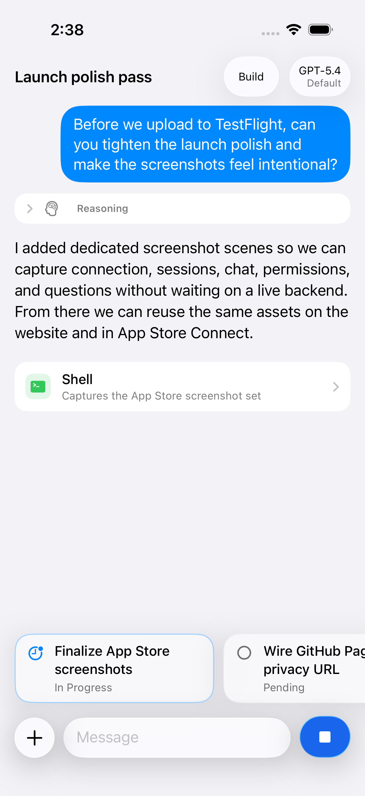
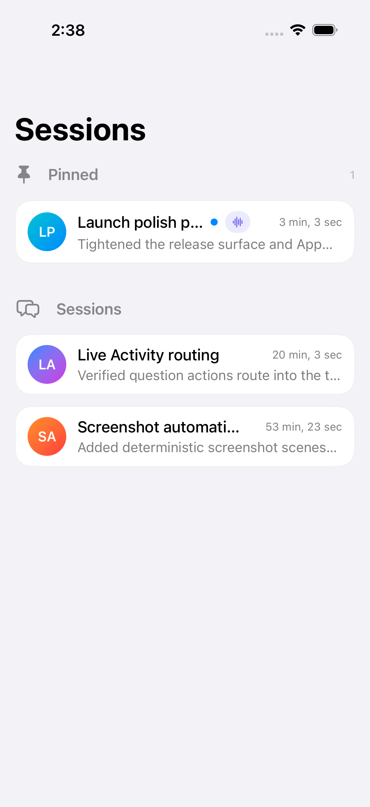
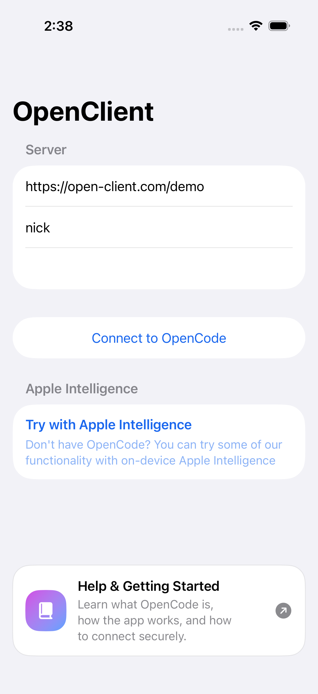
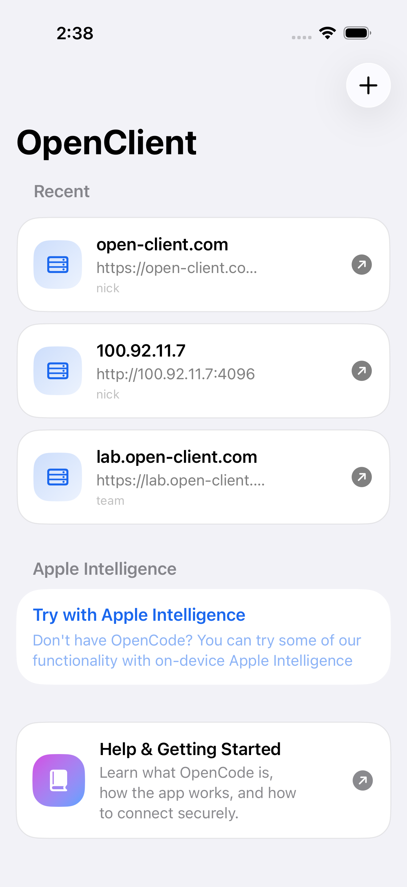
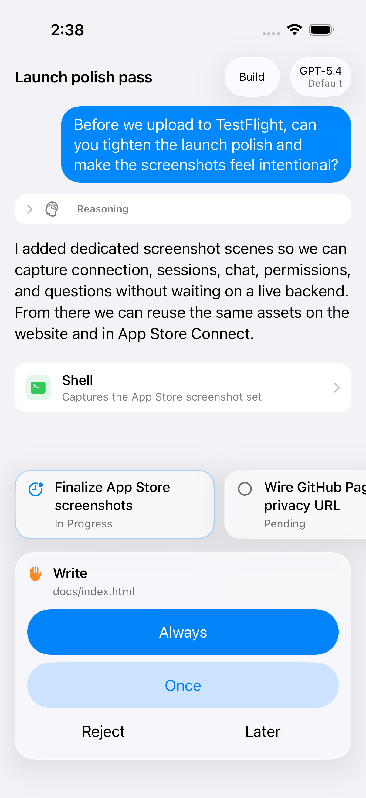
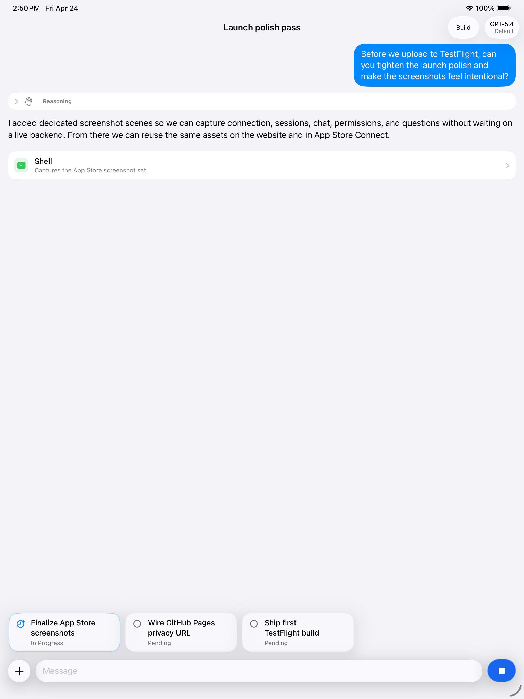

# OpenClient

OpenClient is a native iPhone and iPad companion for your own self-hosted OpenCode server.

Keep your coding sessions within reach when you are away from your desk. Browse projects, resume chats, answer permission and question prompts, follow active work, and reconnect quickly to the servers you use most.

<p align="center">
  
  
  
</p>

## Why OpenClient

- **Native mobile control for OpenCode**: connect to your OpenCode server from a fast SwiftUI interface built for iPhone and iPad.
- **Project and session navigation**: browse projects, inspect sessions, and jump back into the work that needs attention.
- **Chat that follows server state**: continue conversations with streamed assistant output, message history, and tool activity.
- **First-class prompts**: answer permission requests and questions from the same session-focused interface.
- **Self-hosted by design**: use your own local network, tailnet, reverse proxy, or HTTPS endpoint.
- **Quick reconnect**: save recent servers so you can move between machines without re-entering connection details.

## Screenshots

<p align="center">
  
  
  
</p>

<p align="center">
  
</p>

## Built For Self-Hosted OpenCode

OpenClient connects to the OpenCode server you configure. It supports private lab machines, local network addresses, Tailscale-style setups, and public HTTPS endpoints.

Authentication uses the OpenCode server's HTTP Basic Auth credentials, backed by `OPENCODE_SERVER_PASSWORD` and optional `OPENCODE_SERVER_USERNAME` on the host machine. Server passwords are stored in the iOS Keychain.

## Current Capabilities

- Connect to an OpenCode server and verify server health.
- Browse known projects and project-scoped sessions.
- Create and open sessions.
- Send messages and receive streamed responses.
- Render session-local todos, permission prompts, questions, tool activity, and message parts.
- Follow active work with the included Live Activity extension.
- Generate deterministic App Store screenshots without a live backend.

## Project Status

This is an active native client for OpenCode, not an official OpenCode project. The app is intentionally aligned with upstream OpenCode client architecture where possible, especially around shared event streaming, typed events, bootstrap, reducer-style state updates, and project -> session -> chat navigation.

## Requirements

- Xcode 16 or newer recommended.
- iOS 17.0 or newer.
- XcodeGen for regenerating `OpenCodeIOSClient.xcodeproj`.
- An OpenCode server reachable from the device or simulator.
- Optional: fastlane for deterministic screenshot capture.

## Repository Layout

- `OpenCodeIOSClient/`: main SwiftUI app.
- `OpenCodeShared/`: shared code used by the app and Live Activity extension.
- `OpenCodeChatActivityExtension/`: Live Activity extension.
- `OpenCodeIOSClientTests/`: unit tests.
- `OpenCodeIOSClientUITests/`: UI tests and screenshot capture flow.
- `docs/`: marketing site, privacy policy, and curated screenshots.
- `fastlane/`: screenshot automation and local build helpers.
- `project.yml`: XcodeGen project definition.

## Build And Run

Open the generated Xcode project, choose the `OpenCodeIOSClient` scheme, select a simulator or connected device, then press Run:

```bash
open OpenCodeIOSClient.xcodeproj
```

Build for Simulator from the command line:

```bash
xcodebuild -quiet -project OpenCodeIOSClient.xcodeproj -scheme OpenCodeIOSClient -destination 'platform=iOS Simulator,name=iPhone 17' build
```

Build for a connected device:

```bash
xcodebuild -quiet -project OpenCodeIOSClient.xcodeproj -scheme OpenCodeIOSClient -sdk iphoneos build
```

## Regenerate The Xcode Project

Regenerate after changing `project.yml` or adding/removing source files:

```bash
xcodegen generate
```

Use a local ignored XcodeGen override file for personal signing settings:

```bash
cp project.local.example.yml project.local.yml
```

Then set your team in `project.local.yml` and generate with:

```bash
INCLUDE_PROJECT_LOCAL_YAML=1 xcodegen generate
```

If `xcodegen` is installed only in the local user path on this machine, use:

```bash
/Users/mininic/.local/bin/xcodegen generate
```

## Device Install Notes

When installing manually, do not install from a stale repo-local `DerivedData/Build/Products/...` path unless that folder was the explicit `-derivedDataPath` for the build you just ran.

Prefer either Xcode's real `TARGET_BUILD_DIR` or the repo-controlled path when you intentionally build there:

```bash
.derived-data-device/Build/Products/Debug-iphoneos/OpenClient.app
```

The old product name `OpenCodeIOSClient.app` is stale and should not be used for install commands.

## Screenshots And Marketing Site

The GitHub Pages site lives in `docs/`:

- `docs/index.html`: homepage.
- `docs/privacy/index.html`: privacy policy.
- `docs/images/`: curated marketing screenshots.

Generate deterministic screenshots with:

```bash
fastlane ios screenshots
```

Generated PNGs land in:

```bash
fastlane/screenshots/en_US/
```

The screenshot flow launches seeded in-app scenes for connection, recent servers, projects, sessions, chat, permission prompts, and question prompts. It does not require a live backend.

## Local Fastlane Helpers

Useful local lanes:

- `fastlane ios build`: simulator build sanity check.
- `fastlane ios screenshots`: capture App Store screenshots with deterministic UI tests.
