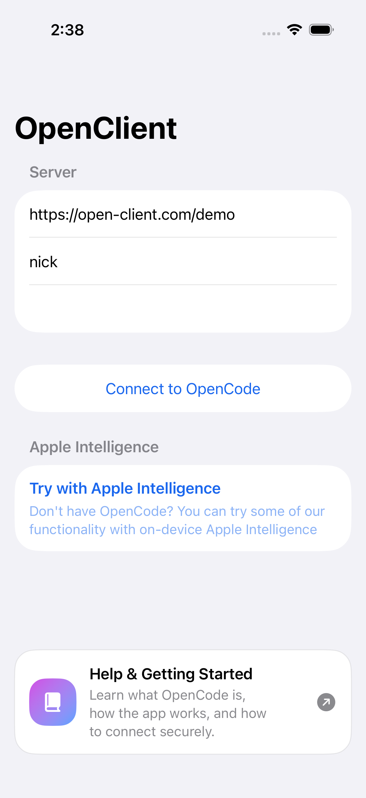
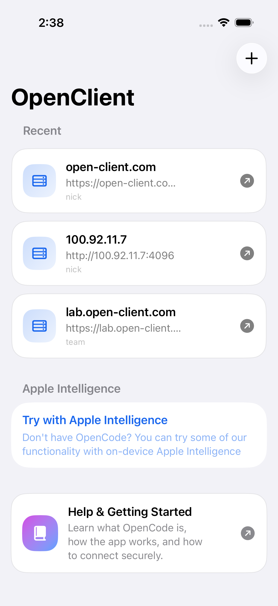
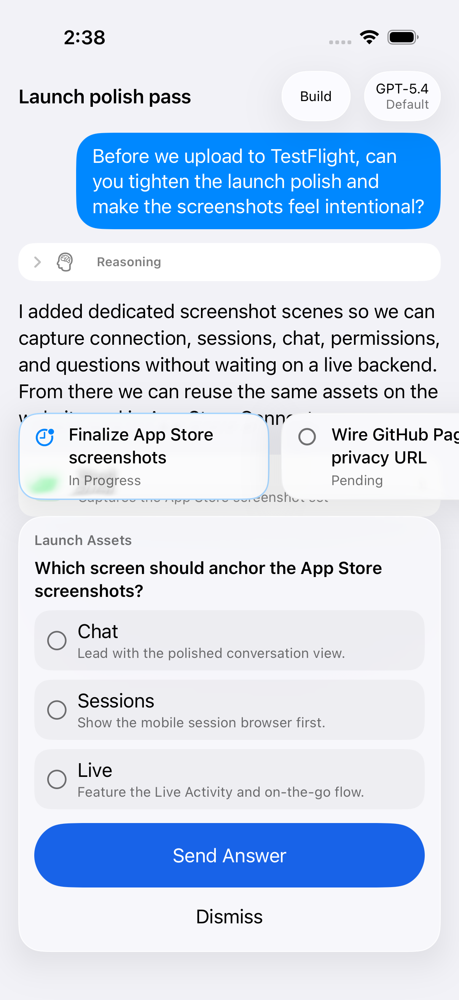

# OpenCode iOS Client Starter

This folder is a starter for a native SwiftUI iOS client that connects to an OpenCode server.

## Intended user flow

1. Enter a server URL such as `http://192.168.1.50:4096` or `https://opencode.example.com`.
2. Enter the OpenCode server username and password.
3. Connect and verify the server is healthy.
4. List or create sessions.
5. Open a session and chat with OpenCode.

## OpenCode server assumptions

The current starter targets the documented endpoints:

- `GET /global/health`
- `GET /session`
- `POST /session`
- `GET /session/:id/message`
- `POST /session/:id/message`

Authentication is HTTP Basic Auth using `OPENCODE_SERVER_PASSWORD` on the host machine and optional `OPENCODE_SERVER_USERNAME`.

## Folder layout

- `OpenCodeIOSClient/OpenCodeIOSClientApp.swift`: app entry point
- `OpenCodeIOSClient/API`: small API client for the OpenCode server
- `OpenCodeIOSClient/Models`: DTOs and connection config
- `OpenCodeIOSClient/ViewModels`: app state and screen orchestration
- `OpenCodeIOSClient/Views`: SwiftUI screens

## Current status

This starter now includes a generated Xcode project:

- `OpenCodeIOSClient.xcodeproj`
- `project.yml` for regenerating the project with XcodeGen

## Local tooling

`xcodegen` was installed locally at:

`/Users/mininic/.local/bin/xcodegen`

## Useful commands

Regenerate the Xcode project:

```bash
/Users/mininic/.local/bin/xcodegen generate
```

Use a local ignored XcodeGen override file for signing on this machine:

```bash
cp project.local.example.yml project.local.yml
```

Then set your team in `project.local.yml` and generate with:

```bash
INCLUDE_PROJECT_LOCAL_YAML=1 /Users/mininic/.local/bin/xcodegen generate
```

Build for Simulator:

```bash
xcodebuild -quiet -project OpenCodeIOSClient.xcodeproj -scheme OpenCodeIOSClient -destination 'platform=iOS Simulator,name=iPhone 17' build
```

Open in Xcode:

```bash
open OpenCodeIOSClient.xcodeproj
```

## Screenshots

Current seeded screenshot set:








## Fastlane

Minimal fastlane release tooling is included in `fastlane/`.

Available lanes:

- `fastlane ios build`: simulator build sanity check
- `fastlane ios archive`: local release archive build
- `fastlane ios beta`: upload to TestFlight
- `fastlane ios release`: upload to App Store Connect without auto-submitting
- `fastlane ios metadata_check`: run `precheck`
- `fastlane ios metadata`: upload App Store metadata from `fastlane/metadata`
- `fastlane ios download_metadata`: pull current App Store metadata into `fastlane/metadata`
- `fastlane ios screenshots`: capture App Store screenshots with deterministic UI tests

Authentication uses an App Store Connect API key via environment variables.

Copy the template and fill it locally:

```bash
cp fastlane/.env.default fastlane/.env
```

Required for TestFlight/App Store lanes:

- `APP_STORE_CONNECT_API_KEY_ID`
- `APP_STORE_CONNECT_ISSUER_ID`
- one of:
  - `APP_STORE_CONNECT_API_KEY_PATH`
  - `APP_STORE_CONNECT_API_KEY_CONTENT`

Example:

```bash
cp fastlane/.env.default fastlane/.env
fastlane ios build
fastlane ios beta
```

`fastlane/.env` is ignored by git.

App Store listing text can live in-repo under `fastlane/metadata/en-US/` and be uploaded with:

```bash
fastlane ios metadata
```

If you want to skip screenshots while getting started:

```bash
FASTLANE_SKIP_SCREENSHOTS=1 fastlane ios metadata
```

Screenshot automation is driven by deterministic UI tests and a dedicated screenshot scheme.

Current screenshot capture path:

- `fastlane/Fastfile` `screenshots` lane
- `OpenCodeIOSClientUITests.testAppStoreScreenshots()`
- dedicated seeded launch scenes via `OPENCLIENT_SCREENSHOT_SCENE`
- current capture devices:
  - `iPhone 17 Pro`
  - `iPhone 17 Pro Max`
  - `iPad Pro 13-inch (M5)`

Run it with:

```bash
fastlane ios screenshots
```

The screenshot flow no longer depends on a live backend. It launches deterministic in-app screenshot scenes for connection, recent servers, projects, sessions, chat, permission prompts, and question prompts.

Generated PNGs land in:

```bash
fastlane/screenshots/en_US/
```

## Website

A simple GitHub Pages site can live in this same repo under `docs/`.

- homepage: `docs/index.html`
- privacy policy: `docs/privacy/index.html`
- publish notes: `docs/README.md`

## Release

For the concrete TestFlight/App Store deployment flow on this machine, see:

- `RELEASE_RUNBOOK.md`

## Recommended next steps

1. Add Keychain-backed credential storage.
2. Add SSE support for `/event` so responses can update in real time.
3. Add request/response logging and better transport errors.
4. Add support for permission prompts and tool activity rendering.
5. Add TLS guidance or a reverse proxy for secure remote access.
